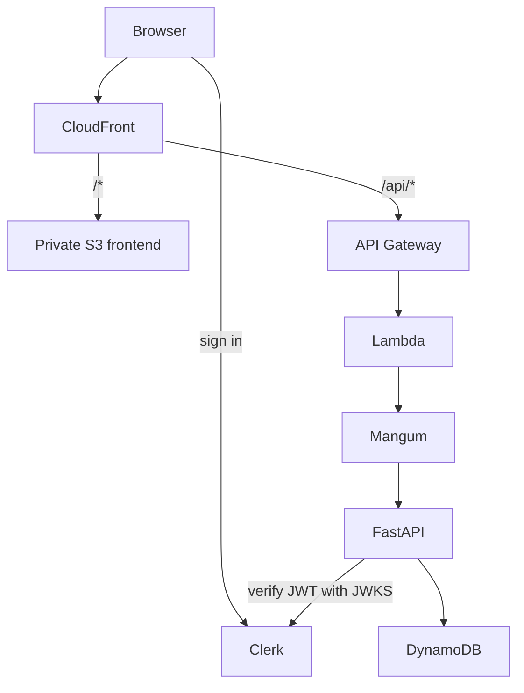

# Runner

Runner is a focused running log for planning workouts, recording execution, and
reviewing weekly mileage. The V1 production application is available at
[chosenrunning.com](https://chosenrunning.com).

## V1

Runner V1 provides:

- Clerk sign-in and private, per-user workout data
- Monday-through-Sunday navigation across past, current, and future weeks
- a seven-day overview with full selected-day workout details
- workout creation, direct inline editing, and confirmed deletion
- derived pace and completion based on entered distance or duration
- an actual-mileage-only 12-week trend with independent navigation,
  week-over-week comparison, and accessible point details

See the [V1 release record](docs/releases/V1.md) for the shipped behavior and
known limitations.

## Architecture



CloudFront is the public entry point for both the React application and the
relative `/api` path. ACM provides TLS for `chosenrunning.com` and
`www.chosenrunning.com`.

## Technology

| Area | Technology |
| --- | --- |
| Web | React, TypeScript, Vite, Clerk React |
| API | FastAPI, Python, Pydantic, Mangum |
| Database | Amazon DynamoDB |
| Authentication | Clerk JWTs; Google is the initial sign-in provider |
| Infrastructure | Terraform, AWS CloudFront, S3, API Gateway, Lambda, ECR, ACM |
| CI/CD | GitHub Actions with AWS OIDC |

## Repository Layout

```text
apps/web/          React application and frontend tests
apps/api/          FastAPI service, domain/repository code, and API tests
infra/terraform/   Runner application infrastructure
infra/bootstrap/   Terraform state and GitHub Actions OIDC bootstrap
scripts/           Local development and validation commands
docs/              Release records, backlog, and design references
.github/workflows/ CI and deployment workflows
```

## Local Development

Install Node.js/npm, Python 3.12+, and
[uv](https://docs.astral.sh/uv/). Then install dependencies and create local
configuration from the tracked examples:

```sh
cd apps/web
npm ci
cp .env.example .env

cd ../api
uv sync --dev
cp .env.example .env

cd ../..
git dev
```

Set the Clerk values in both `.env` files. The API example uses the in-memory
repository; set `WORKOUT_DEMO_USER_ID` to the signed-in Clerk user ID so that
the local demo workouts belong to that user. `git dev` serves the web app at
`http://localhost:5173` and the API at `http://127.0.0.1:8000`.

## Testing and Quality

Run the checks relevant to the area changed:

```sh
git fix-web
git check-web

git fix-api
git check-api

git fix-terraform
git check-terraform
```

The web check runs linting, TypeScript checks, Vitest, and a production build.
The API check runs Ruff, formatting verification, Pyright, and Pytest. The
Terraform check formats and validates both Terraform roots and plans against
their configured state, so it requires appropriate AWS access and Clerk input
variables.

## Authentication and Persistence

The browser obtains a Clerk session token and sends it as a bearer token on API
requests. FastAPI verifies the token and uses its `sub` claim as the storage
user ID; clients cannot choose workout ownership. Production workouts are
stored in DynamoDB, while local development and tests can use the in-memory
repository.

## Deployment

Terraform manages the AWS resources. Path-scoped GitHub Actions workflows test
the web, API, containers, and Terraform. Merges to `main` build and deploy the
web bundle to the private S3 origin and deploy the API as a Lambda container
image through ECR. A manually dispatched Terraform workflow applies application
infrastructure changes. CloudFront serves the application and API under the
custom domain.

## Documentation

- [Runner V1 release record](docs/releases/V1.md)
- [Release documentation policy](docs/releases/README.md)
- [Engineering backlog](docs/ENGINEERING_BACKLOG.md)
- [API development and data seeding](apps/api/README.md)
- [Contribution guide](CONTRIBUTING.md)
